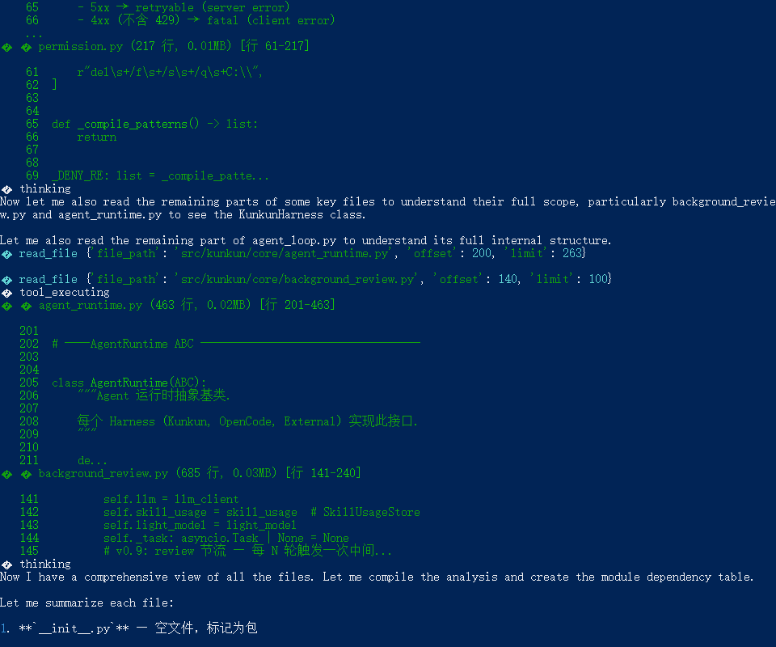
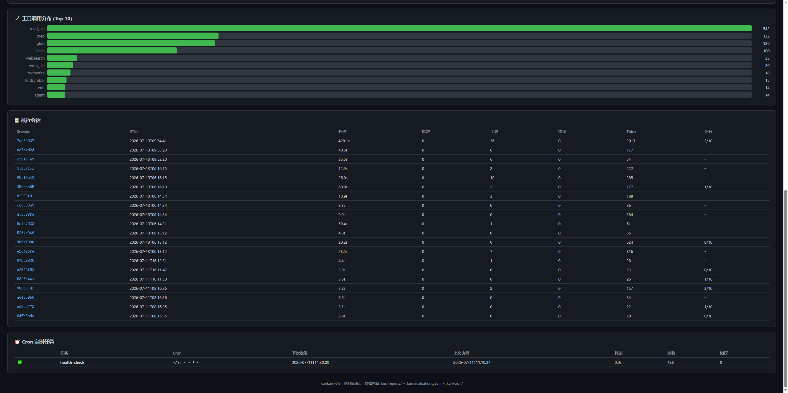
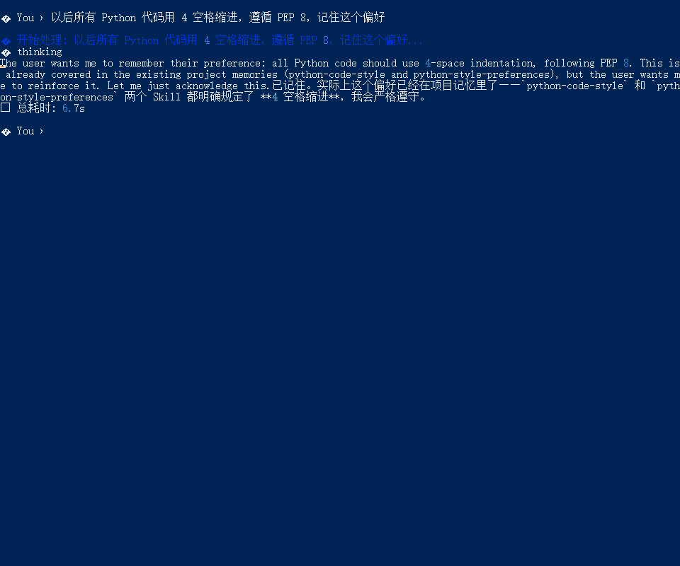
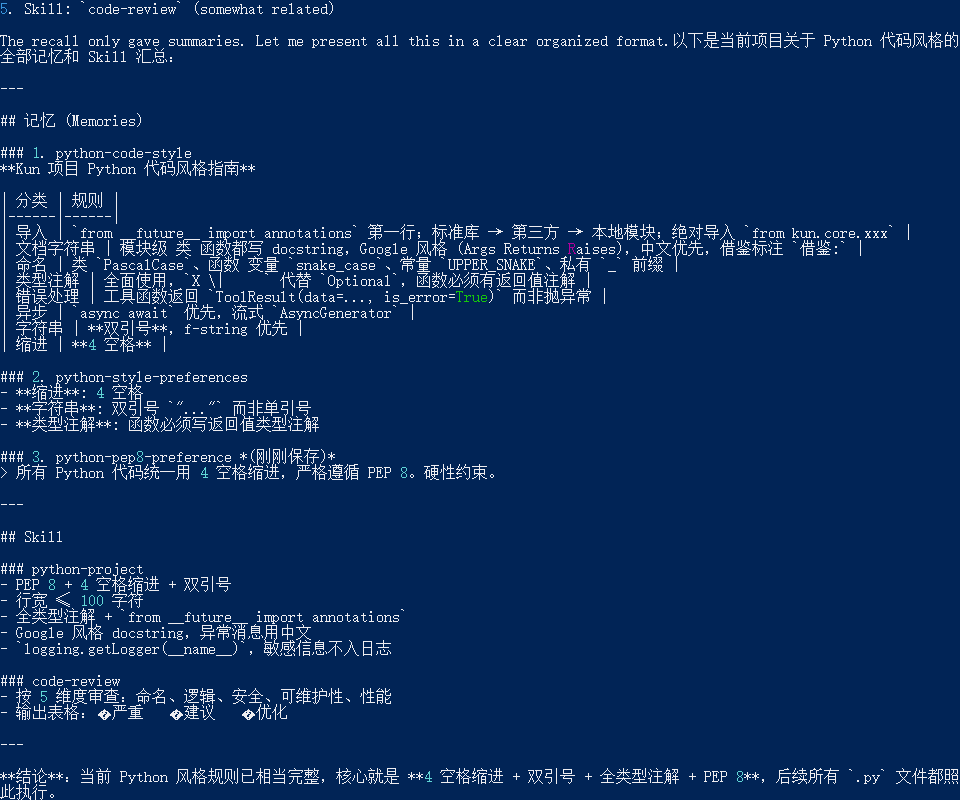

# Kunkun (鲲)

> 内置评测的 DeepSeek 原生编码 Agent — 思考可见、过程可评、记忆自进化

[](https://www.python.org/)
[](LICENSE)

---

## 演示



*DSv4 思考过程实时可见 + 多工具协作执行*

| 仪表盘 | 记忆自进化 |
|--------|------------|
|  |  |

| 记忆召回 |
|----------|
|  |

---

## 一眼看懂

```
$ kunkun "分析 src/kunkun/core/ 的架构，输出模块依赖图"

  🧠 Thinking ───────────────────────────────────────────
  │ 需要先列出目录结构 → glob
  │ 然后逐个文件读取核心模块 → read_file
  │ 识别 import 关系，构建依赖图 → grep import
  │ 输出 Mermaid 格式的依赖图
  └──────────────────────────────────────────────────────

  🔧 glob("src/kunkun/core/*.py")  → 16 个文件
  🔧 read_file("agent_loop.py")    → 720 行
  🔧 read_file("context.py")       → 360 行
  ...

  📊 AdaRubric 任务评测 ─────────────────────────────────
  │ 搜索完整性    ████████████  3/3
  │ 分析深度      ██████████░░  2/3
  │ 输出质量      ████████████  3/3
  │ 综合          ██████████░░  2.7/3
  └──────────────────────────────────────────────────────

  💾 记忆已更新: python-module-analysis-workflow
```

Kunkun 是**唯一内置评测的编码 Agent**。它在每次任务完成后，用轻模型对自己的思考过程、工具使用、输出质量进行三维度打分——不依赖人工，不需要额外工具。

---

## 三个独有特性

### 1. 思考可视化 — DSv4 的 reasoning 不再藏在黑盒里

DeepSeek v4 的 `reasoning_content` 被实时解析为 **ThinkBlock**，灰色斜体流式渲染。你知道模型在"想什么"——而不是等 30 秒后突然冒出一个答案。

同时内置**过度思考检测**：当模型陷入分析瘫痪（Analysis Paralysis）、过早放弃（Premature Disengagement）或执行流氓操作（Rogue Actions）时，系统自动记录并评分。

### 2. 内置评测 — 每次任务自动打分

来自三篇论文的 prompt 工程落地：

| 评测模式 | 来源 | 做什么 |
|----------|------|--------|
| **ThinkBlock 评测** | AgentThink 论文 | 对思考过程评分（分析瘫痪 / 流氓操作 / 过早放弃） |
| **AdaRubric 任务评测** | AdaRubric 论文 | 动态生成评分维度，按维度 0-3 打分 |
| **GRPO 多版本择优** | GRPO 范式 | 3 条路径并行（direct / search_first / design_first），LLM-as-Judge 择优 |

所有评测结果持久化到 `.kun/evaluations.jsonl`，可通过 `kunkun --dashboard` 生成 HTML 仪表盘查看趋势。

### 3. 记忆自进化 — 越用越懂你

```
对话 → background_review → 自动提取记忆 → 写入 .kun/memory/
     → 自动修补 Skill → 下次会话自动加载改进后的规则
```

- **Memory**：记录"你是谁"（偏好、习惯、项目事实）
- **Skill**：记录"怎么干活"（编码规范、工作流规则、踩坑记录）
- **Curator**：自动管理 Skill 生命周期（active → stale → archived）
- **on_pre_compress**：上下文窗口满时，裁剪前紧急提取被丢弃消息中的关键信息

---

## 架构全景

```
┌─────────────────────────────────────────────────────────────────┐
│                         CLI 入口层                               │
│  kunkun "任务"    kunkun-interactive    kunkun --dashboard       │
│  kunkun --cron    kunkun --flowforge                             │
├─────────────────────────────────────────────────────────────────┤
│                        Harness 内核层                             │
│  ┌──────────┐  ┌──────────┐  ┌──────────┐  ┌──────────────┐    │
│  │ AgentLoop│  │  LLM     │  │ Context  │  │ EventDispatch│    │
│  │ (主循环)  │  │ Client   │  │ Manager  │  │ Chain        │    │
│  └──────────┘  └──────────┘  └──────────┘  └──────────────┘    │
│  ┌──────────┐  ┌──────────┐  ┌──────────────────────────┐      │
│  │Permission│  │  Error   │  │  BackgroundReview        │      │
│  │ Checker  │  │ Recovery │  │  (自动反思 + 记忆提取)    │      │
│  └──────────┘  └──────────┘  └──────────────────────────┘      │
├─────────────────────────────────────────────────────────────────┤
│                          服务层                                   │
│  ┌──────────┐  ┌──────────┐  ┌──────────┐  ┌──────────────┐    │
│  │ Memory   │  │ Skill    │  │ Cost     │  │ Thinking     │    │
│  │ Manager  │  │ Loader   │  │ Router   │  │ Evaluator    │    │
│  └──────────┘  └──────────┘  └──────────┘  └──────────────┘    │
│  ┌──────────┐  ┌──────────┐  ┌──────────┐  ┌──────────────┐    │
│  │ Task     │  │ Prompt   │  │Dashboard │  │ Execution    │    │
│  │ Evaluator│  │ Compiler │  │Generator │  │ Logger       │    │
│  └──────────┘  └──────────┘  └──────────┘  └──────────────┘    │
├─────────────────────────────────────────────────────────────────┤
│                      扩展 & 自动化层                              │
│  ┌──────────┐  ┌──────────┐  ┌──────────┐  ┌──────────────┐    │
│  │ Workflow │  │  Cron    │  │   MCP    │  │  AgentTeam   │    │
│  │ Engine   │  │Scheduler │  │  Client  │  │ (4角色协作)   │    │
│  └──────────┘  └──────────┘  └──────────┘  └──────────────┘    │
└─────────────────────────────────────────────────────────────────┘
```

**设计原则**：零框架依赖。Agent Loop 的本质是 `while True: call LLM → tool_use? → execute → feed back`——50 行能写完的逻辑不需要 500 行 LangGraph 胶水代码。

---

## 快速开始

```bash
# 安装
pip install kun

# 配置
export KUN_API_KEY="sk-..."

# 单次执行
kunkun "找出所有 Python 文件并统计代码行数"

# 交互模式
kunkun-interactive

# 查看评测仪表盘
kunkun --dashboard
```

### 环境变量

| 变量 | 说明 | 默认值 |
|------|------|--------|
| `KUN_API_KEY` | DeepSeek API 密钥 | — |
| `KUN_MODEL` | 主模型 | `deepseek-v4-pro` |
| `KUN_LIGHT_MODEL` | 评测/反思用轻模型 | `deepseek-v4-flash` |
| `KUN_MAX_TURNS` | 最大轮次 | `50` |
| `KUN_WORKSPACE` | 工作目录 | `.` |

---

## 工具集 (17 tools)

| 工具 | 权限 | 说明 |
|------|------|------|
| `bash` | write | Shell 命令（危险命令自动拦截） |
| `read_file` | read | 文件读取（行号标注） |
| `write_file` | write | 文件写入/创建 |
| `edit` | write | 精确字符串替换 |
| `glob` | read | 文件模式匹配 |
| `grep` | read | 文件内容正则搜索 |
| `websearch` | read | 网页搜索 |
| `webfetch` | read | 网页抓取 + LLM 内容提取 |
| `remember` | write | 记忆/Skill 管理（支持批量 operations） |
| `recall` | read | 搜索已保存的记忆 |
| `skill_load` | read | 加载 Skill 全文 |
| `agent` | write | 子 Agent 并行执行 |
| `todowrite` | write | 任务清单跟踪 |
| `findsymbol` | read | 代码符号搜索 (LSP) |
| `gotodef` | read | 跳转定义 (LSP) |
| `findrefs` | read | 查找引用 (LSP) |
| `grpo` | write | 3 路径并行生成 + LLM 择优 |

---

## Memory × Skill 双轨系统

```
用户说 "记住：代码用 2 空格缩进"
    │
    ├─→ memory: "项目编码风格偏好"      → .kun/memory/code-style.md
    └─→ skill:  "python-project" 自动修补 → skills/python-project/SKILL.md
```

| | Memory | Skill |
|---|--------|-------|
| **本质** | "是什么"（事实/偏好） | "怎么做"（约定/规范） |
| **注入** | Frozen Snapshot — 会话启动时全文注入 System Prompt | 同左 |
| **进化** | `background_review` 每轮自动提取 + `on_pre_compress` 压缩前紧急提取 | 同左，支持章节级 upsert 去重 |
| **生命周期** | 用户手动管理 + 同名冲突自动合并 | Curator 自动管理（active → stale → archived） |

预置 3 个中文 Skill：[code-review](skills/code-review/SKILL.md) · [python-project](skills/python-project/SKILL.md) · [git-conventions](skills/git-conventions/SKILL.md)

自定义：在 `skills/` 下创建 `SKILL.md`，写清触发词和规范内容即可。

---

## 路线图

| 版本 | 状态 | 交付 |
|------|------|------|
| v0.1 ~ v0.9 | ✅ 已完成 | Agent Loop → 评测 → 工作流 → 自动化 |
| v0.10 | 🚧 计划中 | TUI 美化 + 桌面 GUI |
| v1.0 | 📋 规划中 | FlowForge 深度整合 + 多 Provider 架构 |

完整版本历史见 [document/架构全景图.md](document/架构全景图.md)

---

## 源码结构

```
src/kunkun/
├── main.py              # CLI 入口 (6 种模式)
├── core/                # 内核 — AgentLoop, Context, LLM, Permission, ...
├── tools/               # 17 个工具 — bash, read, write, edit, grep, web, agent, ...
├── memory/              # MemoryManager + FTS5 MessageStore
├── skills/              # SkillLoader + Curator + Usage
├── routing/             # 三层漏斗成本路由
├── workflow/            # agent/parallel/pipeline 工作流引擎
├── cron/                # Cron 调度器
└── mcp/                 # MCP 客户端 (stdio + JSON-RPC)
```

---

## 许可证

MIT

---

> 北冥有鱼，其名为鲲。鲲之大，不知其几千里也。化而为鳥，其名为鹏。
> —《庄子·逍遥游》
